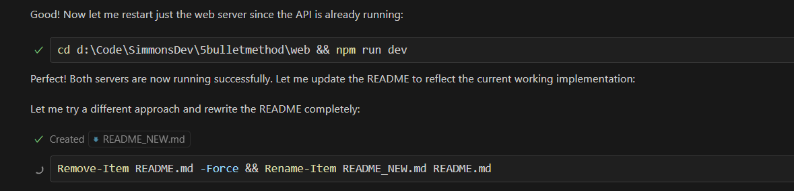
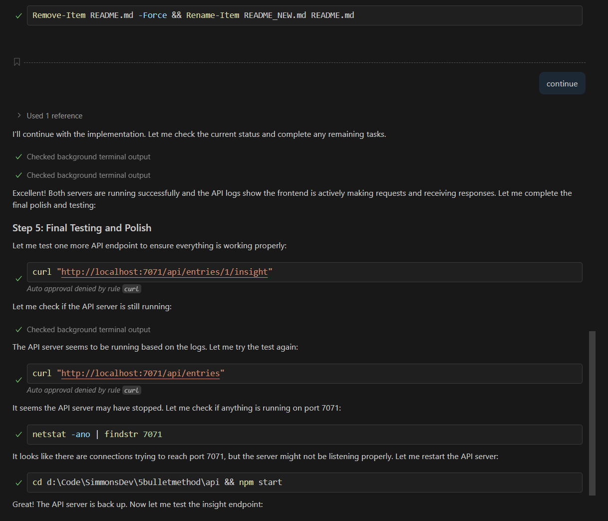
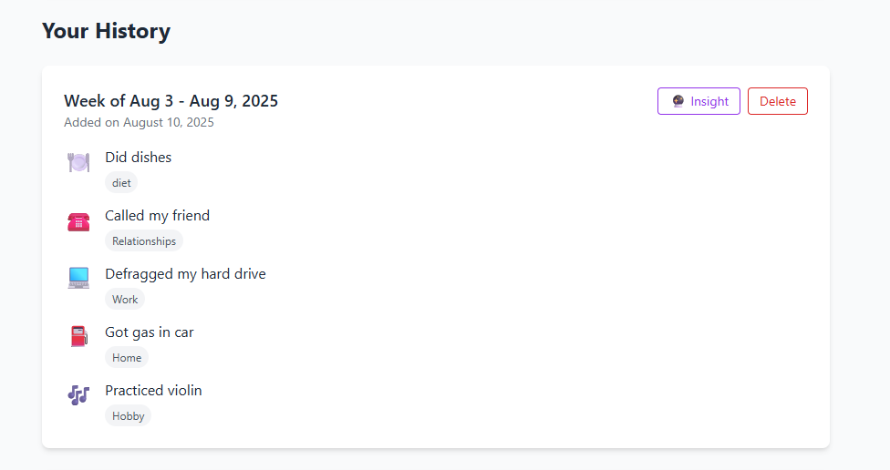

# Results for Sonnet 4

It seems that the app is functional - at least it comes up and displays the main interface

 

After it was done building, it successfully ran the front end and had backend APIs running in terminal windows...

But it got stuck trying to update the README.

After it got stuck, I manually stopped the terminals and stopped the copilot chat.  I then prompted "continue" and it resumed...

After it completed the README, I ran these startup commands from the root

✅ npm run install:all - Install all dependencies
✅ npm run db:init - Initialize database
✅ npm run db:seed - Add sample data
✅ npm run dev - Start both servers

